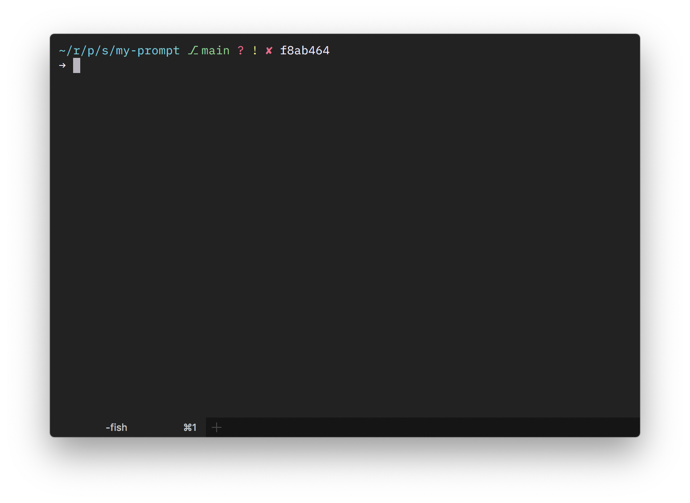

## shprompt

A rewrite of my personal git enabled shell prompt in plain C11.



This version aims to replicate the design of [Gondolin](https://github.com/tylerreckart/gondolin).

### Configuration

You can configure the symbols by modifying `config.h`.

### How to Use

1. Install [cmake](https://cmake.org).
2. Clone this repository.
3. Inside the cloned repo do
   ```
   mkdir build
   cd build
   cmake -DCMAKE_BUILD_TYPE=Release ..
   make
   cp shprompt/shprompt /usr/local/bin
   ```
4. Add the following snippet to your `config.fish`
   ```
   function fish_prompt
     shprompt --status $status
   end
   ```

### Options

For options see `shprompt --help`.
